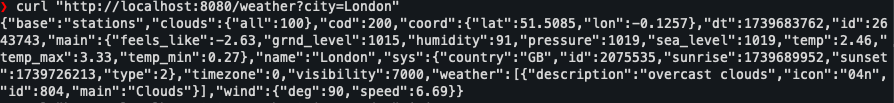

# Max Weather Application - DevOps Technical Assessment

This project demonstrates the implementation of a **highly available**, **scalable**, and **production-ready** weather forecasting platform using **Kubernetes** on **AWS**. The application is protected using **oAuth2** and deployed using **Terraform** and **Jenkins**.

---

## Table of Contents
1. [Project Overview](#project-overview)
2. [Key Features](#key-features)
3. [Architecture Diagram](#architecture-diagram)
4. [Prerequisites](#prerequisites)
5. [Setup Instructions](#setup-instructions)
   - [Terraform Setup](#terraform-setup)
   - [Kubernetes Setup](#kubernetes-setup)
   - [Jenkins Pipeline](#jenkins-pipeline)
   - [oAuth2 Protection](#oauth2-protection)
6. [Testing the Application](#testing-the-application)
7. [Postman Script](#postman-script)
8. [Cleanup](#cleanup)
9. [Troubleshooting](#troubleshooting)
10. [Contributing](#contributing)

---

## Project Overview
The goal of this project is to build a weather forecasting platform that:
- Runs **24/7** with high availability.
- Scales based on traffic.
- Exposes weather forecast functionalities as **APIs**.
- Protects APIs using **oAuth2**.
- Implements a **CI/CD pipeline** for deployment.
- Sends application logs to **AWS CloudWatch**.
- Uses **Terraform** for infrastructure setup.

---

## Key Features
- **Infrastructure as Code (IaC)**: Terraform scripts to provision AWS resources.
- **Kubernetes**: Deploy and manage the application using EKS.
- **oAuth2 Protection**: Secure APIs using AWS Cognito and Lambda Authorizer.
- **CI/CD Pipeline**: Jenkins pipeline for automated deployment.
- **Postman Script**: Test the API with proper authentication.

---

## Architecture Diagram
)

---

## Prerequisites
1. **AWS Account**: With permissions to create EKS, ECR, API Gateway, and Lambda resources.
2. **Terraform**: Installed on your local machine.
3. **Kubectl**: Installed and configured to access the EKS cluster.
4. **Jenkins**: Installed and configured with AWS and Kubernetes plugins.
5. **Docker**: Installed to build and push Docker images.
6. **Postman**: Installed to test the API.

---
### Folder Structure

   max-weather/
   ├── terraform/ # Terraform scripts for infrastructure setup
   │   ├── main.tf # Main Terraform configuration
   │   ├── variables.tf # Terraform variables
   │   ├── outputs.tf # Terraform outputs
   │   ├── modules/ # Terraform modules
   │   │   ├── eks/ # EKS cluster module
   │   │   ├── vpc/ # VPC module
   │   │   ├── alb/ # Application Load Balancer module
   │   │   ├── cloudwatch/ # CloudWatch module
   │   │   ├── lambda-authorizer/ 
   │   │   └── apigateway/ 
   │
   ├── kubernetes/ # Kubernetes manifests
   │   ├── namespace.yaml # Namespace for the application
   │   ├── secret.yaml # Kubernetes secret for sensitive data
   │   ├── deployment.yaml # Deployment for the weather application
   │   ├── service.yaml # Service to expose the application
   │   ├── ingress.yaml # Ingress for external traffic
   │
   ├── jenkins/ # Jenkins pipeline scripts
   │   └── Jenkinsfile # Jenkins pipeline script
   ├── App/ # App using google api weather
   │   └── app.py 


## Setup Instructions

### Terraform Setup
1. Clone the repository:
   ```bash
   git clone https://github.com/nguyenminh15988/weather
   cd max-weather/terraform

## Setup Instructions

### Terraform Setup
1. **Initialize Terraform**:
   ```bash
   terraform init
2. **Review the Plan**:
   ```bash
   terraform plan and terraform apply 

### Kubernetes Setup
1. **Update the kubeconfig**:
   ```bash
   aws eks update-kubeconfig --name max-weather-cluster --region us-east-1

2. **Deploy the Application**:
   ```bash
   kubectl apply -f kubernetes/namespace.yaml
   kubectl apply -f kubernetes/secret.yaml
   kubectl apply -f kubernetes/deployment.yaml
   kubectl apply -f kubernetes/service.yaml
   kubectl apply -f kubernetes/ingress.yaml

# Jenkins Pipeline
- Configure Jenkins with AWS and Kubernetes credentials.
- Create a new pipeline job and point it to the Jenkinsfile in the repository.
- Run the pipeline to build, push, and deploy the application.

# oAuth2 Protection
- Set up an AWS Cognito User Pool and App Client.
- Deploy the Lambda Authorizer to validate oAuth2 tokens.
- Secure the API Gateway endpoints using the Lambda Authorizer.

# Testing the Application
## Get an Access Token
- Use the Cognito /oauth2/token endpoint to get an access token.

## Call the Protected API
- Use the access token in the Authorization header to call the weather API.

# Postman Script
- Import the weather-api.postman_collection.json file into Postman.
- Set the environment variables (base_url, api_key).
- Run the collection to test the API with proper authentication.

# Tested result 


# Cleanup
## Destroy Terraform Resources
```bash
terraform destroy
